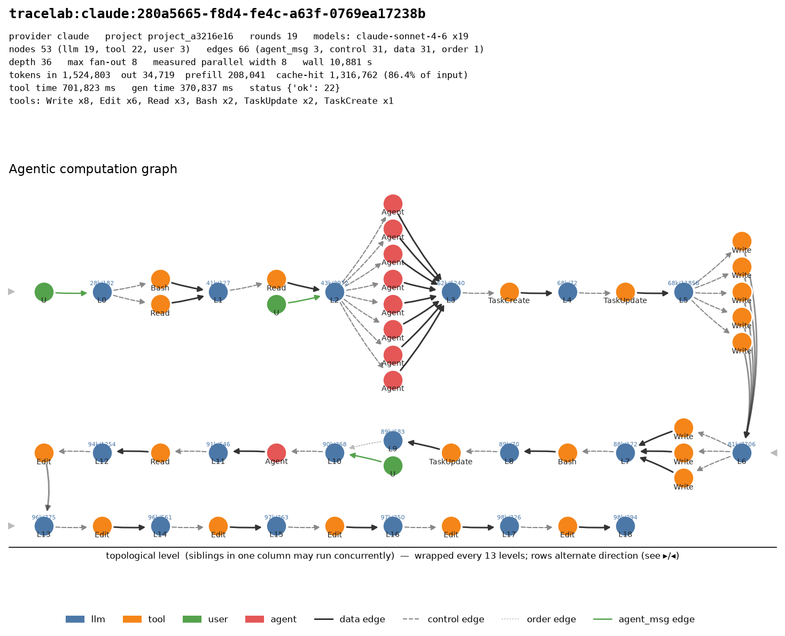

# Agentic Computation Graphs

When an LLM agent solves a task it makes many calls: it reasons, calls tools, and feeds the
results back. The trace of those calls and their data dependencies is the **Agentic Computation
Graph (ACG)**: each node is one LLM or tool call, each edge a data dependency. Graph size drives
cost and latency directly.

This project measures ACGs two ways:

1. **Controlled instrument** (`acg/`). A thin emergent agent loop on a locally served model with
   pinned decode settings, traced with OpenTelemetry and reconstructed offline into a DAG. About
   **2,000 runs** of tool using multi hop QA over a fictional corpus (so answers cannot come from
   memory; closed book accuracy is 0/8 on the enriched task families).
2. **Public trace corpus** (`characterization/`). **153,486 graphs / 13.9M nodes** extracted from
   four public agent trace datasets into one schema.

The question: for the same task and model, how much does the graph change from run to run, what
shape does it have, and what drives that shape?



## Setup (controlled runs)

| Model | Precision | Tool parser |
|---|---|---|
| Qwen2.5-7B-Instruct | BF16 | hermes |
| Qwen2.5-14B-Instruct | FP8 (8 bit) | hermes |
| Qwen2.5-14B-Instruct | AWQ (4 bit) | hermes |
| Llama-3.1-8B-Instruct | BF16 | llama3_json |

All served with vLLM on one 24 GB H100 MIG slice. Default decode: temperature 0.7, top_p 0.95,
varied seed per run. Two benchmarks: 12 canonical QA tasks (2 to 4 hops, 16 docs, tools
`search / read_document / finish`) and an enriched benchmark (61 docs, BM25, 5 task families that
each induce a distinct shape, extra tools `calculator / compare / verify_claim / decompose`,
optional `sub_agent`).

## Results

### 1. Graph size is a distribution, and its variance has three sources

Qwen2.5-7B, task T06 (4 hops), 20 runs per regime:

| Regime | Distinct graph structures |
|---|---|
| fixed seed, prefix cache off | **1** (byte identical) |
| fixed seed, prefix cache on | 3 |
| fixed seed, 8 concurrent requests | 6 |
| varied seed | 9 |

* **Sampling ≫ KV/prefix cache ≫ batching.** Even at temperature 0 with a fixed seed, the prefix
  cache breaks reproducibility: with it on, runs average 13.7 nodes / 7,364 tokens vs 8.0 / 3,303
  with it off. Controlled runs must disable the cache.
* **Temperature is the main knob:** distinct structures go 2 → 8 → 9 → 13 at temperature
  0, 0.3, 0.7, 1.0.
* **Variance scales with hops.** 2 hop tasks yield 1 or 2 shapes in 8 runs; 4 hop T06 yields 6
  shapes in 8 runs and 14 in 50. Eight reps undersample the tail; about 50 per task are needed.

### 2. Agents linearize by policy, even when fan out is available

On the canonical suite, 84% of 7B runs are clean linear chains (width 1, finished, no repeated
call) and 0% show parallel fan out. This holds under every control tested:

* **Corpus:** adding near duplicate distractors drops accuracy 0.77 → 0.56 while the graphs get
  *more* linear (0.82 → 0.91). The agent misreads a distractor rather than querying again.
* **Executor and tools:** with a concurrent executor, a `sub_agent` branch tool, and tasks that
  require a sub chain per entity (6 tasks × 8 reps per cell):

| Model | Accuracy plain → +sub_agent | Runs emitting ≥2 calls/turn (plain) | Runs with executed width ≥2 (+sub_agent) |
|---|---|---|---|
| Qwen2.5-7B BF16 | 0.60 → 0.71 | 6% | 8% |
| Qwen2.5-14B FP8 | 0.81 → 0.56\* | 8% | 2% |
| Qwen2.5-14B AWQ | 0.42 → **0.90** | **42%** | **31%** |
| Llama-3.1-8B BF16 | 0.69 → 0.52 | **0%** | 10% |

\* Tool protocol breakdown (60% of runs emit an unparsed `<tool_call>` as the answer), not a
branching effect.

* **Emitted ≠ executed parallelism.** Without `sub_agent`, executed width never exceeds 1: the
  corpus tools return almost instantly and never overlap in wall clock time, however many calls
  are emitted in one turn.
* **More emitted parallelism is not more capability.** The weakest model (4 bit AWQ) emits the most
  parallel batches (42% of runs, up to 8 per turn).
* **Second model family:** Llama-3.1-8B is the strictest linearizer (exactly one call per turn in
  every plain run). About 50% of both Qwen 7B and Llama runs adopt `sub_agent`, but mostly call it
  serially.
* **`sub_agent` is not a general win:** it helps two models and hurts two.

### 3. The backbone reshapes the graph for the same task

Enriched benchmark, 40 tasks × 6 reps × 2 backbones = 480 runs (7B BF16 / 14B FP8):

| Family | Accuracy | Mean nodes | Runs with width >1 |
|---|---|---|---|
| linear_bridge | 0.89 / 0.92 | 8.8 / 8.8 | 3% / 0% |
| numeric_diff | **0.96 / 0.50** | 8.9 / 5.6 | 1% / 4% |
| counting | 0.77 / 0.77 | 9.9 / 8.1 | 33% / 27% |
| fan_out_superlative | 0.61 / 0.50 | 11.8 / 6.8 | 17% / **44%** |
| unanswerable | 1.00 / 0.92 | 11.8 / 8.5 | 2% / 2% |

* **Width becomes a real variable** once tasks and tools demand aggregation.
* **The 14B FP8 loses by short circuiting the tool loop.** On `numeric_diff`, 50% of FP8 runs finish
  after ≤1 tool call (7B: 1%), and accuracy ≈ 1 minus that rate. FP8 wrong runs average 1.2 nodes,
  its correct runs 9.9 (7B: 9.1). Zero tool parse errors on either model, so the failure is
  behavioral: the graph is bimodal, and a collapsed graph is a clean failure signature.
* **Precision:** on the canonical retrieval suite FP8 beats 7B BF16 (accuracy 0.90 vs 0.77) while
  4 bit AWQ collapses to 0.41 (45% of runs short circuit). On tool composition FP8 degrades
  sharply. Caveat: FP8 vs 7B changes model size and precision at once; without a 14B BF16 control,
  precision is not isolated as the cause.
* **Smaller model ≠ cheaper run.** 7B uses more tokens per task (e.g. 10,353 vs 5,289 on
  `fan_out_superlative`) because it builds bigger graphs.

### 4. Finish decisions are calibrated; every premature stop was wrong

180 runs with elicited reasoning, 697 decision points (7B): P(finish | answer in context) = 0.46 vs
0.05 when it is not. All 19 premature finishes were wrong, and all were the same failure: stopping
one hop early (the town instead of the country). Eliciting reasoning costs +14% tokens without
changing graph width.

### 5. Public traces: the harness bounds size and parallelism

| Dataset | Graphs | Median nodes | Median depth | Median / max fan out | Reasoning | Tokens |
|---|---:|---:|---:|---:|---:|---:|
| TraceLab (production coding sessions) | 4,265 | 46 | 33 | **3 / 29** | 0% | 42.6% |
| SWE-rebench OpenHands | 67,074 | 123 | 122 | 1 / 2 | 71.2% | 0% |
| SWE-agent trajectories | 80,036 | 35 | 34 | 1 / 1 | 100% | 0% |
| OSWorld (Gelato) | 2,111 | 20 | 19 | 1 / 1 | 89.6% | 0% |

* **Parallelism appears only where the harness permits it.** Across 13.1M benchmark nodes max fan
  out is 1 (4 of 67,074 graphs reach 2). TraceLab reaches 29, with 16.8% of rounds issuing multiple
  tools and 88.2% of those overlapping in wall clock time. Harness and model differ between these
  sources, so the split between the two is not attributed here; the controlled runs above show models
  linearize even when the harness allows fan out.
* **Size is capped by configuration.** 8.9% of OpenHands runs sit exactly at 201 nodes (100 iteration
  cap); OSWorld stops at 100 (50 step budget); SWE-agent decays to 817; TraceLab is unbounded (max
  18,482). Published size distributions describe scaffold settings as much as workloads.
* **Cost and semantics are disjoint in public data.** TraceLab has tokens, KV hits and timestamps
  but 0% reasoning; the other three have 71 to 100% reasoning and 0% of every cost field. (Token
  coverage is per node; TraceLab's 42.6% is every LLM node.)

## How it works

```
task ──▶ agent loop (acg/agent.py) ──▶ vLLM (OpenAI API, pinned decode + seed)
             │  model picks each step from a fixed tool set (acg/tools.py)
             ▼
   OpenTelemetry GenAI spans (acg/tracing.py) ──▶ traces/*.jsonl
             │  one span per LLM/tool call, with acg.depends_on data edges
             ▼
   offline reconstruction (acg/graph.py) ──▶ ACG DAG + metrics
             │  nodes by type, depth, emitted/executed width, tokens, latency, outcome
             ▼
   aggregation (scripts/analyze*.py) ──▶ per task distributions + structural variance
```

The loop is deliberately not LangGraph: in a framework you draw the graph yourself; here the model
decides every step, so the structure is the model's.

```
acg/               the instrument (agent loop, tools, tracing, graph reconstruction)
scripts/           experiment runners and analyses
data/              fictional corpora, distractors, task files
characterization/  public dataset extractors, schema, reports, figures
webapp/            React + FastAPI dashboard: live ACG view and replay of archived traces
docs/              implementation, usage, full experiment log, findings
```

## Quickstart

```bash
make venv                      # client deps
make serve                     # vLLM on the GPU (docker/serve_vllm.sh)
make smoke                     # determinism + tool calling check
make single TASK=T06           # one task end to end, draw its ACG
make experiment REPS=8         # variance study over all tasks
make test
webapp/run.sh                  # dashboard on http://localhost:8100
```

## Documentation

[Implementation](docs/01-implementation.md) ·
[Usage](docs/02-usage.md) ·
[Experiment log](docs/07-experiment-log.md) ·
[Findings](docs/08-findings.md) ·
[Enriched benchmark results](docs/12-enriched-benchmark-results.md) ·
[Public trace corpus](characterization/README.md) ·
[Dashboard](webapp/README.md)
