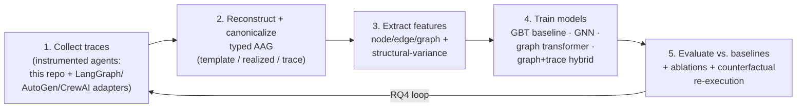

# Characterizing Agentic Application Graphs — A Research Proposal

> **Companion documents.** This plan builds directly on the survey
> [`agentic applications survey.pdf`](agentic%20applications%20survey.pdf) — *"From Static
> Templates to Dynamic Runtime Graphs: A Survey of Workflow Optimization for LLM Agents"* — and
> on the measurement instrument implemented in this repository (see
> [`01-implementation.md`](01-implementation.md), [`05-research-questions.md`](05-research-questions.md),
> [`08-findings.md`](08-findings.md)). The survey supplies the **conceptual apparatus** (the ACG
> abstraction, the template/realized-graph/trace distinction, the quality–cost objective, the
> GDT/GPM taxonomy, the minimum reporting protocol). This instrument supplies the **empirical
> substrate** (an OpenTelemetry-instrumented agent loop that reconstructs ACGs offline and already
> reports node count, depth, width, tokens, latency, outcome, and *structural variance across runs*).
> This proposal turns that pairing into a research program: **measure, model, predict, and optimize
> agentic applications from a graph perspective**, across many domains and frameworks rather than one.

---

## Executive summary

The survey makes a sharp claim: in the LLM-agent literature, **workflow structure is treated as a
first-class object during *method design* but almost never as a first-class object during
*evaluation*.** Papers report *what answer was produced*, rarely *what graph was used, how that graph
varied across inputs, and what it cost*. There is, correspondingly, no shared benchmark, no canonical
graph representation across frameworks, and no predictive theory of how structure drives cost,
latency, reliability, and scalability.

This proposal addresses that gap with four deliverables, in increasing ambition:

1. **A formal, framework-agnostic representation** for *agentic application graphs* (AAGs), unifying
   the survey's template/realized-graph/trace triple with a typed node/edge schema and an attribute
   schema derived from the survey's minimum reporting protocol.
2. **ACG-Bench** — a benchmark and dataset of *instrumented, canonicalized* agentic execution graphs
   collected across domains (QA, tool use, web, code, ops) and frameworks (LangGraph, AutoGen, CrewAI,
   plus this repo's thin loop), capturing **per-task graph distributions and structural variance**,
   not point estimates.
3. **Graph-based characterization and prediction models** — GNN/graph-transformer predictors for
   latency, cost, failure, and reward directly from graph structure, with **structural credit
   assignment** via counterfactual replay.
4. **A structure-aware optimization loop** — using the predictors to recommend graph transformations
   (prune, add-verifier, re-route, select-subgraph) that improve cost-per-success.

The most feasible **3–6 month** core is items 1–3 (representation + benchmark + predictors), reusing
this repository's instrument as the collection harness. Item 4 is a stretch goal / follow-on.

---

## 1. Research motivation and problem definition

### 1.1 What is an agentic application graph?

We adopt and extend the survey's **agentic computation graph (ACG)**. An *agentic application graph*
(AAG) is a directed graph in which **nodes are atomic units of computation** performed by an
LLM-centered system — an LLM call, a tool/API invocation, a retrieval, a memory read/write, a
planner/router decision, or a verifier check — and **edges are dependencies** among them (data,
control, or communication). Following the survey we distinguish three linked objects:

- **Template** `Ḡ = (V, E, Φ, Σ, A)` — the *reusable* design: node set `V`, directed edges `E`,
  per-node parameters `Φ` (prompts, tool schemas, model/decoding choices, verifier settings, memory
  policy), a scheduling/routing policy `Σ`, and the admissible activation/edit actions `A`.
- **Realized graph** `𝒢^run` — the structure *actually used* for a particular input `x` (a subgraph
  selection, an instantiated plan, or an edited structure).
- **Execution trace** `τ = {(sₜ, aₜ, oₜ, cₜ)}` — the states, actions, observations, and per-step
  costs `cₜ` (tokens, tool calls, latency, dollars) produced by running `𝒢^run`.

The object of study is the **realized-graph-plus-trace** as a *random variable*: for a fixed template
and input, sampling and environment stochasticity induce a **distribution over realized graphs** with
non-trivial structural variance (this repository has already demonstrated this empirically — e.g., a
4-hop task producing 6 distinct graph shapes across 8 runs). Characterizing that distribution — its
size, shape, cost, and failure modes — *is the research problem*.

### 1.2 Why a graph-based characterization matters

Once an agentic system is a graph, we can reason about **topology, depth, width, communication
density, verifier placement, and scheduling** — the design choices the survey argues drive both
effectiveness and efficiency. Concretely, graph structure is the natural carrier for the four
non-functional properties the user asks about:

- **Performance / latency** — the **critical path** (longest dependency chain of LLM calls) sets
  wall-clock latency; width sets available parallelism. The survey's `depth`/`width`/`critical-path`
  metrics are exactly graph invariants.
- **Cost** — total tokens and dollars are additive over nodes; *cost-per-success* (the survey's
  preferred metric) is a graph-and-outcome quantity.
- **Reliability** — failure propagates along edges; missing verifier nodes, fragile control flow, and
  excessive depth (the survey's "hidden structural costs") are structural risk factors.
- **Scalability** — how cost and reliability degrade as branching factor, agent count, and depth grow
  is a question about graph *families*, not single runs.

A graph view also enables the thing the survey says is missing: **comparability**. Two systems that
report the same task accuracy may be running wildly different graphs at different costs; only a
structural, distributional account exposes that.

### 1.3 Gaps in the existing literature (what motivates this work)

The survey itself enumerates the gaps; we target the ones amenable to empirical, graph-centric work:

1. **Structure is optimized but not measured.** Dozens of methods (AFlow, G-Designer, MaAS, MetaGen,
   DyLAN, MasRouter, Adaptive Graph Pruning, AgentDropout, DAGP, Maestro …) *generate or edit*
   structure, yet evaluation collapses to a task score. There is **no benchmark of agentic graphs**
   and **no predictive model** from structure to cost/latency/failure/quality.
2. **No canonical cross-framework representation.** LangGraph, AutoGen, and CrewAI emit structurally
   different but often semantically equivalent graphs; the survey notes canonicalization and
   structure-comparison procedures are "rare." This blocks cross-system study.
3. **Point estimates, not distributions.** Benchmarks report a single number per task; the *structural
   variance across inputs and repeated runs* — which the survey flags as "especially informative" — is
   essentially never reported.
4. **Structural credit assignment is unsolved** (the survey's "hardest methodological problem"): given
   a gain, was it a new edge, a new verifier, a changed prompt, or just more compute? This needs
   counterfactual replay over graphs+traces.
5. **No theory of when dynamic structure is needed.** The survey explicitly calls for understanding
   when static templates suffice vs. when generation/editing pays off, and how sample complexity
   scales with structural plasticity (GPM).

### 1.4 Relationship to adjacent problem areas

Agentic application graphs sit at the intersection of several mature systems/ML fields. Each donates
tools; none solves the problem, because the agentic graph is **emergent, stochastic, and semantic**.

| Adjacent area | Graph object | What transfers to AAGs | Why AAGs are different |
|---|---|---|---|
| **Workflow / DAG optimization** (Airflow, Spark/Dryad; Decima RL-scheduling) | fixed task DAG | critical-path analysis, DAG scheduling, makespan/cost models | the DAG is **data-dependent and generated per run** (GPM = generate/edit); a node's cost depends on prompt/context, not a fixed op profile |
| **Distributed-systems tracing** (Dapper, OpenTelemetry, Jaeger; CRISP / Mystery Machine critical-path tracing) | span / causal tree | span instrumentation, tail-latency & critical-path extraction | nodes carry **token/$ cost and semantic outcome** (was the answer correct?), not only latency; this repo already emits OTel GenAI spans, so the bridge is literal |
| **Microservice dependency graphs** (RCA: Seer, Sieve, GNN root-cause localization) | service call graph | bottleneck / root-cause localization, GNNs on call graphs | topology is **model-decided per request**; failures are **semantic** (wrong answer) not just crash/SLO violations |
| **Computational graphs in ML systems** (TF/PyTorch/XLA; TVM/Ansor **learned cost models**) | operator DAG | graph rewriting, operator fusion, learned cost/runtime prediction, typed graph IR | nodes are **non-deterministic LLM calls**; correctness is probabilistic; cost has a token/$ axis; the graph is authored by an LLM |
| **LLM agent planning & orchestration** (survey CORE: AFlow, G-Designer, MaAS, LangGraph) | plan / communication graph | the structure-generation/optimization methods themselves | those works **optimize** structure for one system; we **characterize and predict across heterogeneous systems** — a measurement/benchmark contribution, not another optimizer |

The closest methodological analog is **learned cost models for query plans and tensor programs**
(e.g., cardinality/cost estimation, Bao/Neo; TVM/Ansor). The novelty is transporting that
"predict-cost-from-graph-structure" paradigm to a domain where the graph is generated by an LLM,
varies run-to-run, and whose "cost" includes correctness and dollars.

---

## 2. Proposed graph representation

We propose a **typed, attributed, multi-level** representation. It keeps the survey's template →
realized-graph → trace triple and adds (a) a node/edge type system, (b) an attribute schema aligned
to the minimum reporting protocol, and (c) several abstraction levels with explicit trade-offs.

### 2.1 Nodes (typed)

A node `v` has a **type** and a parameter record. Node types:

| Node type | Represents | Key parameters (Φ) |
|---|---|---|
| `llm_call` | one model invocation (reason/act step) | model id, decode params (temp, top-p, seed), role/system prompt id, context size (tokens), input/output tokens |
| `agent` | a role-scoped LLM subprocess (MAS) | role, model, tool subset, the sub-graph it owns |
| `tool` / `api` | tool or external API invocation | tool name, arg schema, side-effect class, price |
| `retriever` | retrieval / RAG step | index, top-k, query, hit scores |
| `memory` | read/write to state/memory | scope (episodic/long-term), r/w, payload size |
| `planner` / `router` | control decision (which node next, how many, when to stop) | policy type, branching decision, stop rule |
| `verifier` | validity / test / schema / quality check | checker type, pass/fail, cost |
| `control` | START, FINISH, join/fork, retry | — |

The survey's convenient node descriptor `⟨Instruction, Context, Tools, Model/Decoding⟩` is captured
as a subset of `Φ` and covers both single-agent modular pipelines and MAS uniformly.

### 2.2 Edges (typed)

An edge `(u → v)` carries a **dependency type** and payload attributes:

- **Data-flow** — `v` consumes `u`'s output (the repo's `acg.depends_on`); payload size in tokens.
- **Control-flow** — `u` decides whether/when `v` runs (planner/router → node).
- **Communication** — message passing between agents (MAS topology edge).
- **Conditional / routing** — edge active only under a predicate (branch, retry-on-failure).
- **Sequential** — ordering without data dependency (scheduling constraint).

Edges may be annotated with an **activation probability** estimated across runs (crucial for the
template graph, where many edges are conditionally taken) and a **realized/emitted** flag (see §2.5).

### 2.3 Attribute schema (grounded in the survey's minimum reporting protocol)

We lift Table 5 of the survey into a concrete feature schema at three scopes:

- **Node attributes**: type, model, decode params, prompt/instruction id, **context size**, input
  tokens, output tokens, latency, **monetary cost**, tool name, retrieval top-k, **outcome/validity**,
  retries, **number of iterations** the node participates in.
- **Edge attributes**: dependency type, payload tokens, activation probability, conditional predicate id.
- **Graph attributes (per realized run)**: `node_count`, split by type; edge count; **depth**
  (critical path of LLM calls → latency); **width — emitted vs. executed** (this repo's distinction:
  how many tool calls a step *emits* vs. how many actually run concurrently → true parallelism);
  **critical-path length**; **communication volume** (total edge payload); **branching factor**;
  `total_tokens`; **cost-per-success**; termination cause; edit count (for dynamic methods).
- **Graph-family attributes (per task, across runs)**: distribution of each size metric
  (mean/median/p95/max), **structural variance** (# distinct shapes + a graph-edit-distance summary),
  and the **modal-shape fraction** (does a stable core exist?). *These distributional features are a
  primary differentiator of this work* and are already produced by `scripts/run_experiment.py` /
  `determinism_check.py` here.

### 2.4 Prompt and model characteristics as features

Because the survey shows prompt/model choices interact with topology, we encode **prompt
characteristics** (length, few-shot count, whether tool-forcing is on, tool-parser family) and
**model type** (family, precision — this repo already spans BF16/FP8/AWQ) as node features, so
predictors can separate *structural* effects from *backbone* effects (the survey's key confound).

### 2.5 Multiple abstractions and their trade-offs

We deliberately support **four abstraction levels**, chosen per research question:

| Abstraction | What it is | Best for | Trade-off |
|---|---|---|---|
| **A. Template graph** `Ḡ` | reusable structure with conditional/optional nodes | comparing *designs*; static-optimization studies | hides run-time realized cost; edges are probabilistic |
| **B. Realized-graph** `𝒢^run` | structure used for one input (typed DAG) | per-run cost/latency/failure prediction | one sample of a distribution; loses cross-run variance |
| **C. Execution-trace DAG** `τ` | fully expanded span tree with timings & payloads | latency/critical-path, bottleneck RCA, credit assignment | largest; framework-specific noise; needs canonicalization |
| **D. Aggregated structural-variance graph** | per-task multiset/union of realized graphs with edge activation probabilities | scalability & robustness studies; "does a stable core exist?" | lossy summary; requires many runs per task |

Trade-off axis: **A → D increases fidelity to actual behavior but increases collection cost and
framework-specific noise**, and **B/C best support learned prediction** while **A/D best support
structural comparison**. A key methodological contribution is **canonicalization** rules that map A–C
across frameworks to a common typed schema so "superficially different but semantically identical
workflows" (the survey's phrase) are scored consistently.

---

## 3. Benchmarking and dataset strategy

### 3.1 Existing benchmarks: suitability, extractable graph information, limitations, extension

| Benchmark | Domain | Why suitable | Graph info extractable | Limitations | How to extend |
|---|---|---|---|---|---|
| **WebArena / Operator-style / AppWorld** | web / GUI / app agents | long-horizon, tool-and-environment loops → rich realized graphs | action/observation trace → trace-DAG (C); branching from retries | heavy env setup; traces not natively graph-shaped; success is sparse | wrap env with OTel spans; canonicalize action loop into typed AAG |
| **AgentBench** | multi-environment agents | breadth across 8 environments → cross-domain graph families | per-env realized graphs; depth/width | heterogeneous logging; little internal structure exposed | add uniform instrumentation adapter per environment |
| **GAIA** | general assistant, multi-tool | multi-hop tool use → non-trivial depth/width | tool-call graph, retrieval nodes | answers-only reporting; closed reasoning | re-run through an instrumented harness to expose the graph |
| **SWE-bench / Terminal-Bench** | software / CLI agents | repository edits + tests → verifier nodes, long control flow | edit/test/verify graph; retry loops; critical path | very long traces; framework-specific | canonicalize scaffolds (OpenHands SDK) into AAG; label verifier nodes |
| **ToolBench / τ-bench / τ²-bench** | tool & tool-agent-user | dense tool graphs; τ-bench has dual-control (user) edges | tool-call DAG, communication edges (user↔agent) | narrow tool sets; limited topology diversity | inject distractor tools / branch-requiring tasks (as this repo's `tasks_branch.jsonl` does) |
| **MCP-Universe / MCP-Bench / MCP-RADAR / MCPWorld / LiveMCPBench** | MCP tool servers | real tool servers → realistic tool/API nodes; LiveMCPBench enables **drift** | tool/API graphs; **drift over time** | new, uneven coverage | use LiveMCPBench for the drift RQ; controlled tool-registry changes |
| **WorFBench / FlowBench** | **workflow generation** | the *only* benchmarks that treat the workflow/graph as the output; ship reference workflows | reference template graphs; subgraph/subsequence matching | evaluates generation quality, not realized cost | pair generated graphs with *executed* traces to add cost labels |
| **LangGraph / AutoGen / CrewAI traces** | framework-native | closest to real agentic apps; explicit graph objects | template + realized graph directly (esp. LangGraph) | availability/consent; framework-specific schemas; PII | build export adapters; collect via instrumented example apps under license |
| **LLM observability datasets (OTel/LangSmith-style)** | production-like | span trees = trace-DAGs at scale | trace-DAG (C) with real timings/costs | rarely public; no ground-truth quality labels | partner data or self-generated; add task-level reward labels |

**Cross-cutting limitation:** almost none of these ship *graphs with cost+outcome labels and
repeated-run variance*. That is precisely the void ACG-Bench fills.

### 3.2 Synthetic workload generation

To control structure independently of task semantics, we generate **synthetic AAGs** with known
generative parameters (depth `d`, branching `b`, verifier density, agent count `k`, conditional-edge
rate) using the survey's operator vocabulary (search/read/verify/finish/sub-agent — all already
implemented here). Synthetic graphs (a) give ground-truth structural labels for controlled ablations
(e.g., "hold task difficulty fixed, sweep branching"), and (b) let us test whether predictors trained
on synthetic graphs transfer to real ones (a generalization probe for RQ5).

### 3.3 New dataset collection methodology — **ACG-Bench**

Because existing datasets are insufficient (no canonical graphs, no cost+variance labels), we propose
a collection methodology, reusing this repository as the reference harness:

1. **Instrument, don't scrape.** Run agents under an **OpenTelemetry GenAI** exporter (already in
   `acg/tracing.py`), which is framework-neutral. One span per LLM/tool call, with `depends_on` edges.
2. **Multi-framework adapters.** Export LangGraph / AutoGen / CrewAI runs into the same span schema, so
   the *same* typed AAG can be reconstructed regardless of framework (offline reconstruction lives in
   `acg/graph.py`).
3. **Canonicalization pass.** Normalize node/edge types, collapse framework boilerplate, and assign
   stable node ids so graph-edit-distance and subgraph matching are meaningful across systems.
4. **Repeated-run protocol.** For each (task, system, model) run **N reps with varied seeds**, so every
   task yields a *distribution* of realized graphs and a structural-variance summary — the feature this
   field lacks. (This repo's `run_experiment.py`/`determinism_check.py` already do exactly this.)
5. **Label with cost + outcome.** Attach the trace's tokens/latency/dollars and the graded task outcome,
   enabling `cost-per-success` and failure labels.
6. **Coverage matrix.** Domains {QA, tool, web, code, ops} × frameworks {thin-loop, LangGraph, AutoGen,
   CrewAI} × models {BF16 7B, FP8/AWQ 14B, Llama-8B — the four already served here} × plasticity
   {static, select, generate, edit}. Target: O(10⁴–10⁵) labeled realized graphs.

ACG-Bench's headline novelty: **the unit of data is a graph with a cost+outcome label and a
per-task structural-variance profile**, released with canonicalization rules — turning the survey's
"minimum reporting protocol" into a reusable artifact.

---

## 4. Experimental models and methods

### 4.1 Graph analysis (unsupervised / descriptive)

- **Motif & subgraph mining** — find recurring structural motifs (e.g., `retrieve→read→verify→finish`,
  fan-out sub-agent stars, retry loops) and test their association with success/cost.
- **Centrality analysis** — betweenness/critical-path centrality to locate **bottleneck nodes**
  (latency) and load-bearing verifiers (reliability).
- **Community detection / clustering** — group realized graphs into **workload classes**; detect
  sub-agent communities in MAS graphs.
- **Graph edit distance & spectral distances** — quantify structural variance and cross-system
  similarity; power the "stable core" analysis.
- **Graph embeddings** (graph2vec / WL kernels) as cheap baselines before deep models.

### 4.2 Learning-based prediction

**Prediction tasks** (each a supervised head over a graph encoder):

| Task | Target | Type |
|---|---|---|
| Latency prediction | wall-clock / critical-path time | regression |
| Cost prediction | total tokens, dollars | regression |
| Failure prediction | run fails / wrong answer | classification |
| Quality / reward prediction | task score / cost-per-success | regression |
| Bottleneck identification | per-node "on critical path / limiting" | node classification |
| Workload classification | domain / plasticity class | graph classification |
| Graph similarity | are two graphs same class / near-duplicate | metric learning |

**Encoder architectures** (in increasing capability):

1. **Tabular / hand-crafted baselines** — gradient-boosted trees over graph invariants (node counts by
   type, depth, width, branching, structural-variance features). *Must be beaten to justify GNNs.*
2. **GNNs** — GCN / GAT / GraphSAGE over the typed AAG with node/edge features; heterogeneous-GNN
   (R-GCN/HGT) to respect node/edge types. Regression/classification heads per task.
3. **Graph transformers** — capture long-range dependencies (deep critical paths) that message-passing
   GNNs under-reach; positional encodings from topological order.
4. **Hybrid graph + trace (structure + sequence)** — a GNN over the realized graph fused with a
   sequence model over the execution trace `τ` (timings, retries), since latency/failure depend on
   *dynamics* not only topology. This "graph-and-trace" model directly targets the survey's point that
   evaluation must report *what happened*, not only structure.
5. **LLM + graph reasoning** — prompt an LLM with a serialized graph (or GNN-derived embeddings) for
   zero/few-shot bottleneck explanation and transformation suggestions; useful where labels are scarce
   and interpretability matters.
6. **Graph foundation model (stretch)** — pretrain a single encoder on ACG-Bench (self-supervised: mask
   nodes/edges, predict cost) and fine-tune per task — a step toward a reusable AAG representation.

### 4.3 Structural credit assignment (targeting the survey's hardest open problem)

Train the predictor to support **counterfactual replay**: estimate `ΔR`, `ΔC` when a node/edge is
ablated (remove a verifier, prune a communication edge, cut a sub-agent). Compare model-predicted
counterfactuals against **actual re-execution** of the ablated graph (the ground truth). A predictor
that recovers true ablation effects is direct evidence that structure — not just compute — is being
credited correctly.

---

## 5. Research questions

Each RQ states **motivation → hypothesis → experiments → metrics**. RQ1–RQ5 follow the user's outline;
RQ6–RQ7 add the survey's open problems (credit assignment, drift).

### RQ1 — Structural characterization
- **Motivation.** The survey argues good structure ≠ more compute, but the discriminating structural
  features are unknown.
- **Hypothesis H1.** High-performing agentic runs occupy a distinct region of structural feature space
  (bounded depth, presence of verifier motifs, low redundant communication); failure correlates with
  excessive depth and missing verification.
- **Experiments.** Motif/centrality analysis on ACG-Bench; contrast success vs. failure graph
  distributions per domain; motif-enrichment tests.
- **Metrics.** Motif odds-ratios; AUROC of a structure-only failure classifier; effect sizes for
  depth/verifier-density on outcome.

### RQ2 — Performance & cost prediction
- **Motivation.** If cost/latency are predictable from structure *before/without* full execution, we
  get planning, budgeting, and scheduling for free (the DB "learned cost model" analogy).
- **Hypothesis H2.** A GNN over the realized (or template) graph predicts latency and token cost within
  small error, and structural features (depth, width, communication volume) dominate.
- **Experiments.** Train latency/cost regressors; ablate feature groups (structure-only vs.
  +prompt/model features); compare template-graph vs. realized-graph vs. trace inputs.
- **Metrics.** MAE / MAPE / R² for latency & tokens; feature-importance (SHAP / GNNExplainer);
  calibration of p95 tail prediction.

### RQ3 — Scalability
- **Motivation.** The survey warns capability gains carry "hidden structural costs"; how cost/reliability
  scale with graph complexity is unquantified.
- **Hypothesis H3.** Cost grows super-linearly with branching factor and agent count; reliability
  declines with depth beyond a task-dependent knee; there is a measurable depth×branching→reliability
  surface.
- **Experiments.** Synthetic sweeps (§3.2) holding task difficulty fixed while varying `d, b, k`;
  fit scaling laws; validate on real graphs.
- **Metrics.** Fitted scaling exponents; reliability-vs-depth knee location; variance-explained.

### RQ4 — Optimization
- **Motivation.** Can characterization *recommend* improvements (the bridge from analysis to the
  survey's optimization methods)?
- **Hypothesis H4.** Predictor-guided graph transformations (prune redundant edges/agents, insert a
  cheap verifier at a high-centrality node, select a leaner subgraph on easy inputs) improve
  cost-per-success vs. the unmodified system, matching hand-designed pruners (AgentDropout/DAGP) without
  task-specific engineering.
- **Experiments.** Use counterfactual predictor (§4.3) to propose top-k transformations; **re-execute**
  transformed graphs; compare to (a) original, (b) random edit, (c) published pruning baselines.
- **Metrics.** Δ cost-per-success; Pareto (quality vs. cost) dominance; win-rate vs. baselines.

### RQ5 — Generalization
- **Motivation.** A characterization model is only useful if it transfers across apps/frameworks/models.
- **Hypothesis H5.** A predictor trained on some domains/frameworks generalizes to unseen ones with
  graceful degradation, because structural cost-drivers are partly universal (depth→latency,
  communication→tokens).
- **Experiments.** Leave-one-domain-out, leave-one-framework-out, and synthetic→real transfer;
  measure zero-shot vs. few-shot fine-tune.
- **Metrics.** Transfer gap (in-dist vs. OOD error); few-shot sample efficiency; per-axis breakdown.

### RQ6 — Structural credit assignment *(survey open problem #1)*
- **Motivation.** Attribute gains to *edges/verifiers/prompts vs. compute*.
- **Hypothesis H6.** Counterfactual-trained predictors recover true ablation effects better than
  compute-only baselines.
- **Experiments.** Predicted vs. actual ablation deltas across node/edge removals.
- **Metrics.** Correlation / rank-correlation between predicted and re-executed `ΔR, ΔC`.

### RQ7 — Robustness & drift *(survey open problem #3)*
- **Motivation.** Tools/APIs/registries change; static structure decays.
- **Hypothesis H7.** Structural-variance features predict fragility under paraphrase, tool-failure
  injection, retrieval noise, and tool drift (via LiveMCPBench).
- **Experiments.** Perturbation suite from the survey's robustness list; measure structure→robustness
  correlation and recovery cost after drift.
- **Metrics.** Performance drop under perturbation; adaptation-efficiency (extra cost to recover).

---

## 6. Proposed experimental framework (end-to-end)

**Pipeline stages** (reusing this repo's existing components in brackets):

1. **Collect** agent execution traces across the coverage matrix `[acg/agent.py, acg/tracing.py, webapp pipeline]`.
2. **Convert** traces → canonicalized typed AAGs `[acg/graph.py + new adapters/canonicalizer]`.
3. **Extract** node/edge/graph + variance features `[extends scripts/analyze.py]`.
4. **Train** predictors (per RQ) with the encoder ladder of §4.2.
5. **Evaluate** against baselines with ablations and **counterfactual re-execution**.

**Baselines.** (a) constant/mean predictor; (b) tabular GBT over graph invariants; (c) trace-only
sequence model (no structure); (d) published pruners (AgentDropout, DAGP) for RQ4; (e) OneFlow-style
strong single-agent baseline (to check whether structure matters at all for a given task — the
survey's caution about over-claiming multi-agent gains).

**Datasets.** ACG-Bench (self-collected) as primary; GAIA / τ-bench / SWE-bench / ToolBench /
WorFBench / LiveMCPBench as external validity and for domain coverage; synthetic graphs for controlled
sweeps.

**Metrics.** Regression: MAE/MAPE/R² (+ tail calibration for p95). Classification: AUROC / F1.
Structure: motif odds-ratios, graph-edit-distance, modal-shape fraction. Optimization: Δ
cost-per-success, Pareto dominance. Generalization: OOD transfer gap.

**Ablation studies.** (i) input abstraction (template vs. realized vs. trace); (ii) feature groups
(structure-only vs. +prompt vs. +model); (iii) encoder family (GBT vs. GNN vs. graph-transformer vs.
hybrid); (iv) with/without structural-variance features; (v) canonicalization on/off (does it improve
cross-framework transfer?); (vi) reps-per-task (how many runs are needed to estimate variance well).

---

## 7. Potential novel contributions and 3–6 month feasibility

| # | Contribution | Venue fit | Feasibility (3–6 mo) |
|---|---|---|---|
| C1 | **AAG representation + canonicalization** across frameworks (typed schema + rules) | systems/ML methods | **High** — extends existing `graph.py`; mostly engineering + design |
| C2 | **ACG-Bench**: dataset of labeled realized graphs with cost/outcome + structural-variance | NeurIPS/ICLR **D&B track**, MLSys | **High** — reuses this repo's harness; main cost is breadth of collection |
| C3 | **Graph predictors** for latency/cost/failure/reward (GNN + hybrid) | MLSys / ML | **High–Medium** — standard GNN stack on C2 data |
| C4 | **Structural credit assignment** via counterfactual replay | ML / systems | **Medium** — needs re-execution budget but conceptually crisp |
| C5 | **Predictor-guided graph-transformation recommender** (optimization loop) | systems (OSDI/NSDI/EuroSys), MLSys | **Medium–Low** — depends on C3; strongest paper if it lands |
| C6 | **Graph foundation model** for agentic workloads (pretrained AAG encoder) | ML | **Low** — stretch/follow-on |

**Recommended 3–6 month scope:** **C1 + C2 + C3**, with **C4** as the differentiating result and a
**pilot of C5** (predictor-guided pruning on 1–2 domains) to demonstrate impact. This yields a coherent
D&B/MLSys submission: *a benchmark of agentic application graphs + graph-based predictors of cost,
latency, and failure + a first counterfactual account of structural credit.* It is feasible on the
existing single-MIG-slice, four-model setup because collection is cheap (short QA/tool tasks) and the
modeling is standard once data exists.

**Why this is the feasible high-value target:** it directly fills the survey's stated evaluation gap,
reuses a working instrument, and produces a reusable artifact (benchmark) that other groups need — the
kind of contribution that compounds.

---

## 8. Additional insights and unexplored directions

- **Cost-per-success as a first-class label.** Most benchmarks label correctness; ACG-Bench should label
  the full quality–cost pair so the *Pareto frontier* (not accuracy alone) is the object of study — the
  survey's `max E[R − λC]` made empirical.
- **Emitted vs. executed width** (already isolated in this repo) is a subtle but important feature:
  models often *emit* parallel calls that don't *execute* in parallel. Predictors and scalability laws
  should use executed width; the gap itself is a diagnostic of wasted structure.
- **A "when is dynamic needed?" empirical law.** The survey names this as a missing theory. ACG-Bench
  can answer it empirically: measure, per task family, the accuracy/cost gap between static templates
  and generate/edit plasticity, and identify the structural signatures (high structural variance, high
  branching) that predict when dynamic pays off — a concrete step toward the survey's "toward a theory."
- **Bottleneck localization = microservice RCA.** Port GNN root-cause methods from microservice tracing
  to identify the LLM/tool node that limits latency or causes failure; the OTel bridge makes this direct.
- **Critical-path tracing for agents.** Adapt CRISP/Mystery-Machine critical-path analysis to agentic
  graphs to attribute wall-clock time to specific reasoning chains — an efficiency lens absent from the
  agent literature.
- **Security/reliability angle.** Typed AAGs enable structural policies (e.g., "every tool with
  side-effects must be dominated by a verifier node"); graph analysis can *audit* agentic apps for
  missing safeguards — a governance contribution.
- **Graph-transformation as compilation.** Frame the RQ4 recommender as an *agentic-graph compiler*
  (rewrite passes with a learned cost model), borrowing directly from TVM/XLA — a clean systems framing
  for a follow-on.
- **Reproducibility standard.** Ship the canonicalization rules + the minimum reporting schema as a
  small library so any framework's traces become comparable AAGs — operationalizing the survey's plea
  for comparable, reproducible workflow evaluation.

---

### Deliverables & rough timeline (3–6 months)

| Month | Milestone |
|---|---|
| 1 | Finalize AAG schema + canonicalizer (C1); LangGraph/AutoGen adapters; extend `analyze.py` feature extractor |
| 2 | Collect ACG-Bench v0 (QA + tool domains, 4 models, static+select) with variance; release schema |
| 3 | Baselines + GNN predictors for cost/latency/failure (C3); RQ1–RQ2 results |
| 4 | Add web/code/ops domains + generate/edit plasticity; RQ3 scaling laws (synthetic + real) |
| 5 | Counterfactual credit assignment (C4, RQ6); pilot predictor-guided pruning (C5, RQ4) |
| 6 | RQ5 generalization + RQ7 drift; write-up; release ACG-Bench + models |

**Primary risks & mitigations:** (i) *cross-framework trace access* → start with self-instrumented apps
+ this repo, add frameworks incrementally; (ii) *label cost* (re-execution for RQ4/RQ6) → cap with the
cheap QA/tool tasks and the existing local models; (iii) *structure-vs-compute confound* → always
include the OneFlow-style single-agent baseline and prompt/model features in ablations.
